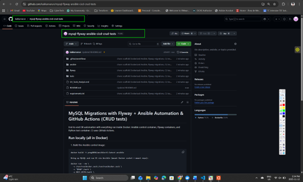
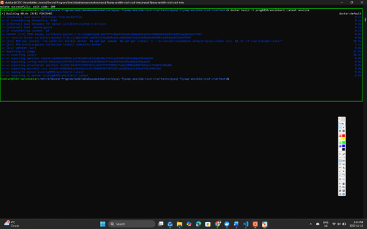
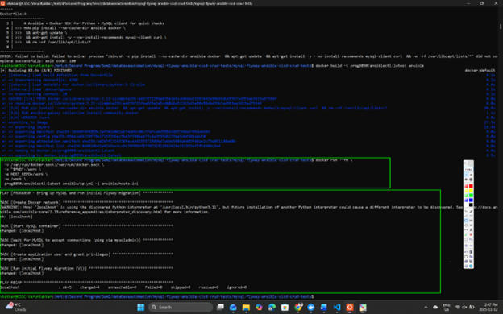
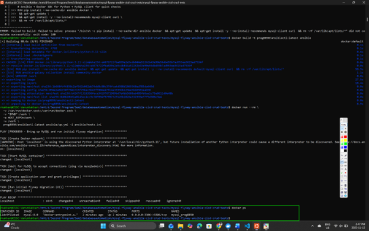
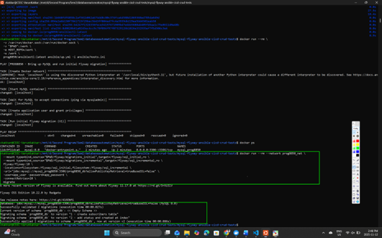
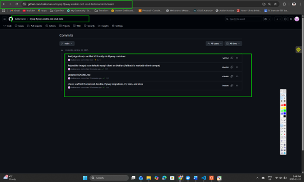

# MySQL Migrations with Flyway + Ansible Automation & GitHub Actions (CRUD tests)

[](https://github.com/kakkarvarun/mysql-flyway-ansible-cicd-crud-tests/actions/workflows/ci.yml)

End-to-end database automation **entirely in Docker**: Ansible (inside a container) provisions MySQL and runs **Flyway V1**; Flyway (container) applies **V2**; tests run via **pytest** in a Python container. CI is handled by **GitHub Actions**.

---

## Prerequisites
- Docker Desktop running (Linux container mode)
- Repo cloned locally (no spaces in final repo folder path recommended)
- Internet access to pull Docker images

---

## Project Structure (key files)

ansible/
Dockerfile
up.yml
down.yml
hosts.ini
flyway/
migrations_initial/
V1__create_subscribers_table.sql
migrations_incremental/
V2__add_status_and_created_at_index.sql
tests/
test_subscribers.py
.github/workflows/
ci.yml
requirements.txt
Q1_Tools_Analysis.md
README.md


---

## Run Locally (All in Docker)

### 1) Build the Ansible control image
```bash
docker build -t prog8850/ansiblectl:latest ansible

2) Bring up MySQL and run initial migration (V1) via Ansible

docker run --rm \
  -v /var/run/docker.sock:/var/run/docker.sock \
  -v "$PWD":/work \
  -e HOST_REPO=/work \
  -w /work \
  prog8850/ansiblectl:latest ansible/up.yml -i ansible/hosts.ini

✅ Expected: tasks end with no failures (ok/changed); mysql_prog8850 container is up.

3) Apply incremental migration (V2) with Flyway (both locations)

Why both locations? Flyway must see the already-applied V1 when applying V2; otherwise validation fails.

docker run --rm --network prog8850_net \
  --mount type=bind,source="$PWD/flyway/migrations_initial",target=/flyway/sql_initial,ro \
  --mount type=bind,source="$PWD/flyway/migrations_incremental",target=/flyway/sql_incremental,ro \
  flyway/flyway:10 \
  -locations=filesystem:/flyway/sql_initial,filesystem:/flyway/sql_incremental \
  -url="jdbc:mysql://mysql_prog8850:3306/prog8850_db?allowPublicKeyRetrieval=true&useSSL=false" \
  -user=app_user -password=app_password \
  -connectRetries=20 \
  migrate

✅ Expected: Successfully applied 1 migration for V2.

4) Run CRUD tests (pytest) in a Python container

Important: inside the test container, use DB_HOST=mysql_prog8850 (container name) on the shared network.

docker run --rm \
  --network prog8850_net \
  -e DB_HOST=mysql_prog8850 \
  -e DB_PORT=3306 \
  -e DB_NAME=prog8850_db \
  -e DB_USER=app_user \
  -e DB_PASS=app_password \
  -v "$PWD":/work -w /work \
  python:3.11-slim bash -lc "pip install -r requirements.txt && pytest -q"


✅ Expected: 1 passed (or similar).

5) Tear down (remove container and network)

docker run --rm \
  -v /var/run/docker.sock:/var/run/docker.sock \
  -v "$PWD":/work \
  -w /work \
  prog8850/ansiblectl:latest ansible/down.yml -i ansible/hosts.ini


CI/CD (GitHub Actions)

Pipeline steps defined in .github/workflows/ci.yml:

Start MySQL service container

Create app_user with privileges on prog8850_db

Run Flyway V1 (initial)

Run Flyway V2 with both locations (initial + incremental)

Run pytest and upload JUnit XML artifact

Print Deployment done for commit $GITHUB_SHA

In your repo → Actions tab:

You should see a green run, logs of V1/V2, tests passing, and the final echo line.

Artifacts section contains test-reports/junit.xml.

Screenshot Checklist (for grading)

✅ Ansible up: PLAY RECAP (ok/changed, no failed)

✅ docker ps showing mysql_prog8850 running

✅ Flyway V2 applied locally (success output)

✅ Local pytest passed in container

✅ GitHub Actions run green

V1 applied (log snippet)

V2 applied (log snippet; shows both locations)

pytest passed (log snippet)

Final echo: “Deployment done for commit …”

Artifacts panel showing test-reports

Troubleshooting

Flyway validation error (“applied migration not resolved locally”):
Re-run V2 with both locations:

-locations=filesystem:/flyway/sql_initial,filesystem:/flyway/sql_incremental


MySQL 8 RSA public key error:
Ensure the URL has:

?allowPublicKeyRetrieval=true&useSSL=false

Tests cannot connect to DB (timeout/refused):
Use DB_HOST=mysql_prog8850 (not 127.0.0.1) and ensure both containers are on prog8850_net.

Q1 Report (Tools Analysis)

See Q1_Tools_Analysis.md for Flyway vs Liquibase comparison and the CI/CD strategy

## Evidence (Screenshots)

> All images are stored in `screenshots/` and demonstrate local Docker runs and CI logs as required by the rubric.

### 1) Repository (public)
  
*Repo is public with required folders: `ansible/`, `flyway/`, `tests/`, `.github/workflows/`, etc.*

### 2) Build Ansible control image
  
*`docker build -t prog8850/ansiblectl:latest ansible` completed successfully.*

### 3) Ansible up: MySQL + V1
  
*Play recap shows network created, container started, user granted, and V1 applied (no failures).*

### 4) MySQL running
  
*`mysql_prog8850` is up and listening on 3306; attached to `prog8850_net`.*

### 5) Flyway V2 migration
  
*V2 applied using **both locations** (`migrations_initial` + `migrations_incremental`).*

### 6) Commit checkpoints
  
*Meaningful commit messages showing scaffold, fixes, and verification checkpoints.*

### 7) Initial pytest failure (diagnostic)
  
*Failure against `127.0.0.1` documented prior to switching to `DB_HOST=mysql_prog8850`.*

### 8) DB reachable + test env
  
*`mysqladmin ping` returned OK; test container invoked with `DB_HOST=mysql_prog8850`.*

### 9) CRUD tests passed
  
*`pytest -q` shows `1 passed` in container on `prog8850_net`.*

### 10) CI: V1, V2, tests, artifact, echo
  
*GitHub Actions shows V1 applied, V2 applied (both locations), tests passed, JUnit XML uploaded, and **“Deployment done for commit …”** printed.*
